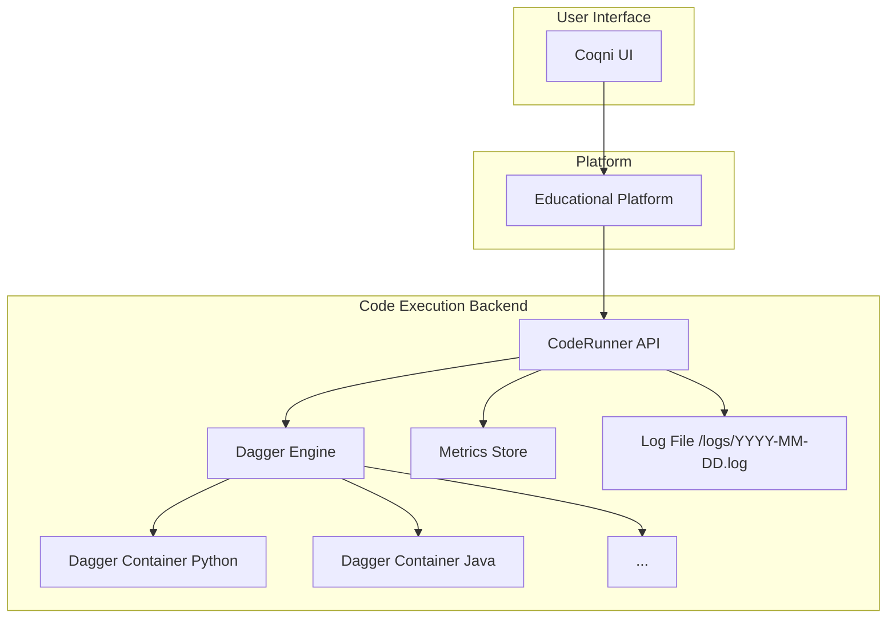
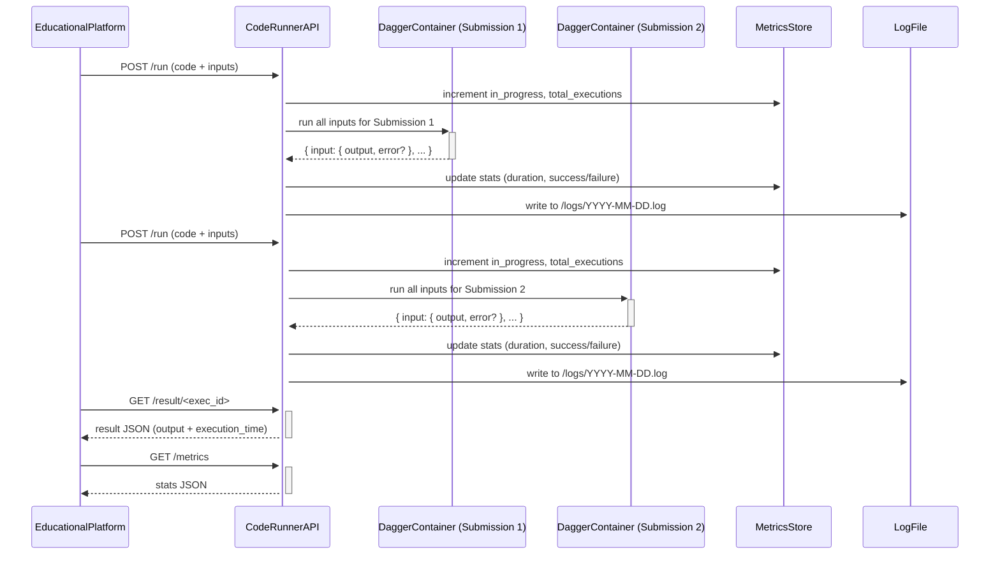

# Code Runner

### Archtecture



### Data Flow



---

### ✅ Requirements

1. **Python ≥ 3.10**
   - Dagger requires `async` and `await`, supported from Python 3.7, but ≥3.10 is recommended.
   - Check:
     ```bash
     python --version
     ```

2. **[Dagger CLI & Engine](https://docs.dagger.io/install/):**
   - Install:
     ```bash
     brew install dagger/tap/dagger  # macOS
     # or via install script:
     curl -L https://dl.dagger.io/dagger/install.sh | sh
     ```
   - Test:
     ```bash
     dagger version
     ```

3. **Docker (for container execution)**
   - Dagger uses Docker internally, so Docker must be running:
     ```bash
     docker version
     ```

4. **Python dependencies**
   - Install with `pip`:
     ```bash
     pip install flask flasgger dagger-io
     ```

---

### 📂 Local Project Structure (Example)

```
.
├── app.py                  # your main code runner (Flask)
├── runners/
│   └── runner.py           # language-specific runner for Python
├── logs/                   # created automatically
```

---

### ⚙️ Environment Variables

Set before starting:

```bash
export CODE_LANGUAGE=python
export API_TOKEN=mysecrettoken
```

---

### 🚀 Run

```bash
python app.py
```

Then open Swagger:
```
http://localhost:5000/swagger/index.html
```

---

### 📡 Example Call via `curl`

```bash
curl -X POST http://localhost:5000/run \
  -H "Content-Type: application/json" \
  -H "x-api-key: mysecrettoken" \
  -d '{
    "code": "return str(int(input_str) * int(input_str))",
    "inputs": ["4", "x"]
}'
```

Then:
```bash
curl -H "x-api-key: mysecrettoken" http://localhost:5000/result/<exec_id>
```
